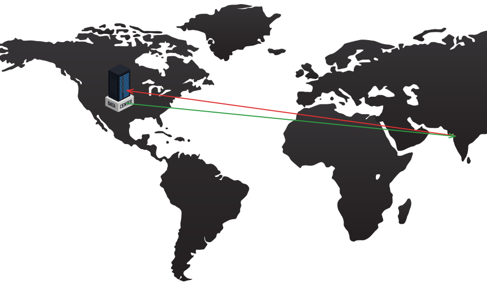

:::note
It would be better if you already have some knowledge of how serverless functions/services work before reading this.
:::
## What is cloud computing?
I know the article is about edge computing in Next.js, but I think for that, we need to first understand what cloud computing is.

Cloud computing was the first revolution that changed how people built applications. Earlier we relied mainly on local computing and local infrastructure. 
But the use of <!--truncate-->
cloud services (vendor-managed infrastructure) helped reduce costs and headaches for businesses and developers.

Now, the "cloud" exists somewhere; the data centers managed by cloud providers are dispersed worldwide.
You can read more about [AWS Regions, Availability Zones and Local Zones](https://docs.aws.amazon.com/AmazonRDS/latest/UserGuide/Concepts.RegionsAndAvailabilityZones.html) to get an understanding of what this means.

These data center locations make a significant difference when building scalable applications that need to handle thousands of requests a second, from users situated at various geographic locations.
The farther the data center from the place where the user is situated, the more the [latency](https://www.cloudflare.com/learning/performance/glossary/what-is-latency/) the user experiences.

Who wants to see a loading indicator and wait for multiple seconds before seeing their desired content? No one.

How do you reduce the latency? Well, some classic solutions are:
- Choosing the data center closest to the user geographically
- Using CDNs ([Content Delivery Networks](https://www.cloudflare.com/learning/cdn/what-is-a-cdn/))
- Setting a network path such that there are fewer hops in intermediate routers
- Edge Computing :)
(More solutions exist, like using load balancers, indexing your database etc. but they aren't relevant to the article so I will not be covering that right now.)

## What is edge computing and how does it help?
Now that we know about edge computing, let's understand what edge computing is and how it helps with the issue of latency.

In edge computing, data processing and storage functions are moved **away from centralized data centers** to **servers closer to the network edge**, closer to the **users and devices accessing the data.**
Thus the network connectivity is improved and the latency is reduced. This is especially good for real-time data feeds.

After reading this, take a look at this image that I found on Akamai's website:

## Next.js's edge runtime
Whatever we have learnt about edge computing is sufficient to now understand what Next.js's edge runtime is, and why it's useful.
To implement edge computing, you need an edge runtime environment on the edge device that can execute applications and handle data locally. 
The Next.js middleware (we will cover this in the next section) uses such an environment or runtime, which is built on top of the [V8 engine](https://v8.dev/), allowing it to run in isolated execution environments that don't require a container or virtual machine.

Let's first read what Next.js has to say:
> In the context of Next.js, runtime refers to the set of libraries, APIs, and general functionality **available to your code during execution.**
>
> On the server, there are two runtimes where parts of your application code can be rendered:
>
> - The **Node.js Runtime** (default) has access to all Node.js APIs and compatible packages from the ecosystem.
> - The **Edge Runtime** is based on Web APIs.

The question is, if Edge really is the best -- offering lower latency, better caching capabilities and more, why do we still have to make a choice?
Well the Edge Runtime has some catches, take a look at the caveats listed on Next.js's own site:

> - The Edge Runtime does not support all Node.js APIs. Some packages may not work as expected. Learn more about the [unsupported APIs in the Edge Runtime](https://nextjs.org/docs/app/api-reference/edge#unsupported-apis).
> - The Edge Runtime does not support Incremental Static Regeneration (ISR).
> - Both runtimes can support streaming depending on your deployment infrastructure.

However, these issues are currently being addressed by the community (as we will see in the next sections).

## Understanding Next.js middleware

I had a tough time understanding what the Next.js middleware is really about. Coming from an Express.js background, I initially confused Next.js middleware with the traditional Express middleware. Let's clear that first:

- Express middleware can be applied globally, to specific routes, or even to groups of routes. It can be Application-wide or route-specific.
- The purpose of Next.js "middleware" is to intercept the request, and work on it, maybe rewrite URLs, redirecting, modifying headers, or even directly responding to the user.

Whereas Express runs on a server itself, and thus the middleware is also on the server doing checks on the server itself; Next.js middleware is running on the edge (think of edge as a part of CDN) and not on the server.

As of now Next.js (stable version) middleware runs exclusively on the Edge Runtime. That's great, right? Low-latency, faster retrievals and hence highly optimized. But that is not really the case, edge runtimes like every other technological innovation has its flaws.

## What are some issues developers face?
If you check the [Github Discussion: 71727](https://github.com/vercel/next.js/discussions/71727), you will come to realise multiple developers complaining about how default edge runtime as middleware is hampering how they handle DB connections, authentication request blocking etc.

So the problem is that edge runtime does not support most traditional databases and ORMs. It's good for some basic functionalities, but doing authentication checks will require you to make calls to your API server which defeats the purpose of edge computing. (Read this entire thread: [Authentication problems in Next.js middleware](https://github.com/vercel/next.js/discussions/71727#discussioncomment-11123480))
Moreover, edge runtimes do not preserve state, thus each request to the DB is a new DB connection.
To solve this problem, ORMs like Drizzle and Prisma have already worked on making adapters to connect to serverless DBs (like Neon Postgres and Supabase Postgres). For example, [Prisma Accelerate](https://www.prisma.io/blog/database-access-on-the-edge-8F0t1s1BqOJE) which is a connection pooler, and hence reuses database connections allowing you to interact with your DB over HTTP.
If you're able to find the technologies capable of running on Edge runtimes, then you're in for a treat, but there are still other reasons why you might want to use a Node.js runtime, like configuring one middleware handler to determine which requests to deny and accept based on auth permissions. 

Next.js did understand the problems developers were facing, so they just recently (approximately three weeks before this blog was published) merged a [Pull Request: 75624](https://github.com/vercel/next.js/pull/75624) allowing an option to select runtime for the middleware! (Right now merged in Next.js Canary)

## Final summary (This was a lot to digest)

First, let's summarise whatever we know about edge runtime in a table, compared to Node.js runtime:

| **Aspect**               | **Edge Runtime**                          | **Node.js Runtime**                       |
|--------------------------|-------------------------------------------|-------------------------------------------|
| **Base**                 | Web APIs                                  | Full Node.js APIs                         |
| **Use Case**             | Middleware, low-latency functions         | Application rendering, complex operations |
| **API Support**          | Limited, no dynamic code evaluation       | Comprehensive, supports all Node.js APIs  |
| **Performance**          | High, due to edge server proximity        | May have higher latency, cold starts      |
| **Database Connection**  | Challenging, stateless, often via proxies | Easier, supports persistent connections   |

What you choose is completely up to your use case. If you want low latency, fast retrievals and maybe support streaming without worries of data querying from maybe a database, use Edge as your middleware runtime.
But if you're having to make a call to your API anyway, maybe switch to Node.js as your runtime. The future of edge computing does seem bright though, as more APIs and more technologies are supported on the edge.

:::note
I am writing this blog after studying about edge computing from various credible sources, but if I err please reach out to me or raise an [issue](https://github.com/ShauryaSwarup/shaunotes/issues)
:::

Some related links and articles:
- [Next.js edge runtime documentation](https://nextjs.org/docs/app/api-reference/edge)
- [Next.js middleware documentation](https://nextjs.org/docs/app/building-your-application/routing/middleware)
- [Edge computing - Cloudflare](https://www.cloudflare.com/learning/serverless/glossary/what-is-edge-computing/)
- [Vercel's edge runtime docs](https://edge-runtime.vercel.app/)
- [Database challenges in serverless and edge](https://www.prisma.io/blog/overcoming-challenges-in-serverless-and-edge-environments-TQtONA0RVxuW)
- [Reddit post about database driver/clients compatible with edge](https://www.reddit.com/r/nextjs/comments/1fjvq0d/which_database_driverclient_works_on_edge/)
