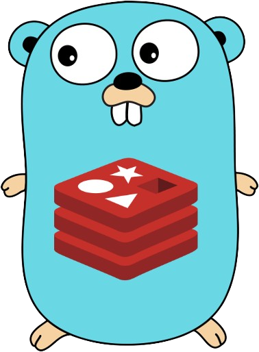

import './goredis.css'

# Why did I build this?

- I was really curious about how **Go** handles **concurrency**, and how a scalable application/server is ideally written in Go. 
- I researched a little and came across **Redis** as a prime example to learn about **GoRoutines, Channels** and the concept of **concurrency**.

👉 What's better than building a project to learn more about a language?

So here I am, writing as I build a Go Redis (key-value) database.
## Learnings

I will update this as I make progress in my project

Day 1

  - Built the server and RESP protocol parser
    - Concurrent client request reading (achieved using GoRoutines and Channels)
    - Accepting peer connection and handling disconnection
    - Reading client input while avoiding buffer leaks
    - Understood the RESP protocol and implemented the parser
    - Understood the need of single threaded command execution in Redis (achieved using Channels)

